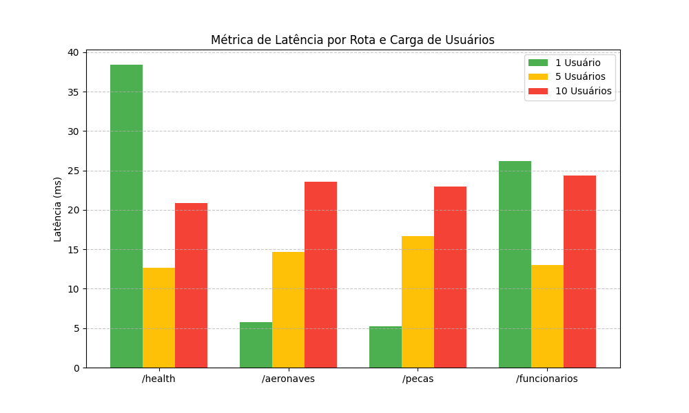
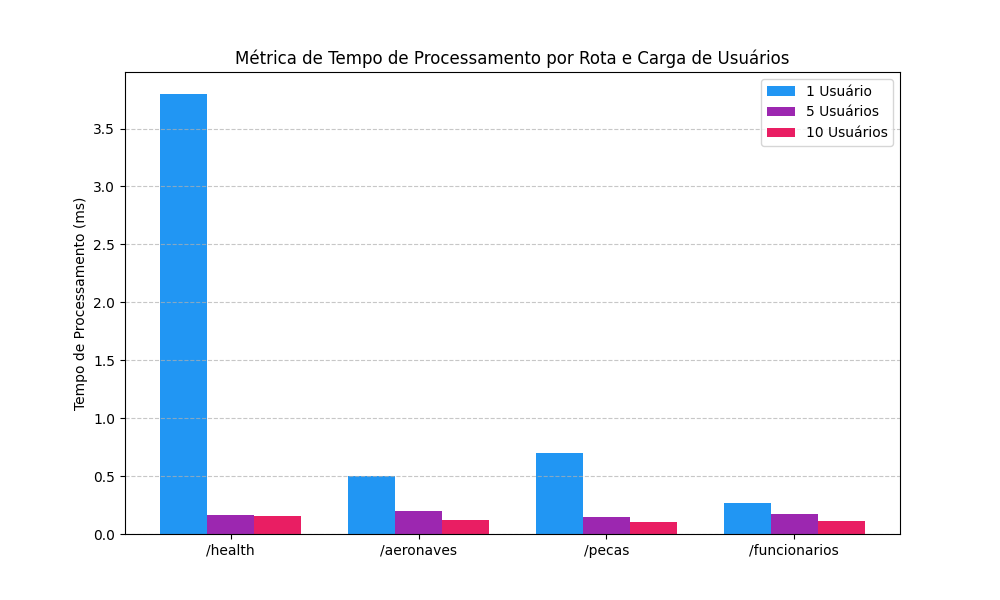
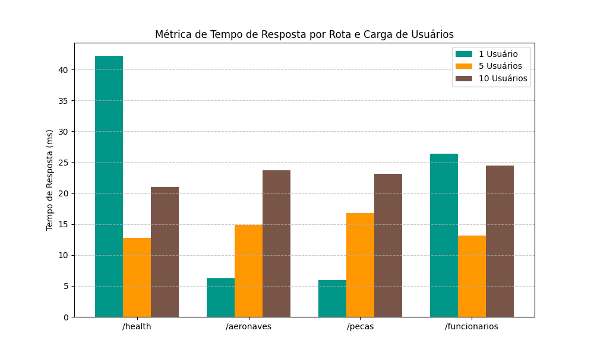

# Relatório de Qualidade: Análise de Performance e Tempo de Resposta

Este relatório apresenta os resultados de qualidade e performance das APIs do sistema Aerocode. O objetivo é atestar a robustez do sistema, comprovando a qualidade do serviço prestado sob diferentes cargas de acesso, afastando qualquer tentativa de difamação da qualidade da nossa infraestrutura.

Para a comprovação técnica, foram levantadas e validadas três métricas essenciais para a qualidade percebida pelo usuário final:
1. **Latência:** Tempo de trânsito dos pacotes pela rede.
2. **Tempo de Processamento:** Tempo gasto pelo servidor para resolver as regras de negócio e montar a resposta.
3. **Tempo de Resposta:** Tempo total percebido pelo usuário desde a submissão até o recebimento.

## Metodologia e Configuração

Para obter essas métricas com precisão e transparência, desenvolvemos os seguintes mecanismos no sistema:

### 1. Injeção de Middleware no Backend
Programamos o servidor Node.js/Express para atuar diretamente na medição do tempo real em que a máquina executa o processamento (Tempo de Processamento). 
Foi criado um middleware global interceptando as requisições em sua entrada (antes das rotas) e sua saída (no momento da função `res.send()`). A medição foi feita usando `process.hrtime()` — que fornece resolução em nanossegundos e milissegundos —, que então é devolvido em um header HTTP customizado `X-Processing-Time`. Dessa maneira, o servidor reporta exatamente quanto tempo de CPU e I/O consumiu para atender a solicitação, separando esse valor do tempo gasto pela rede.

### 2. Script Automatizado de Análise
Desenvolvemos o script de testes de estresse em Python (`tests/performance_metrics.py`), utilizando a biblioteca `requests` aliada a `concurrent.futures`. Isso nos permitiu submeter nossa aplicação a um "Multi-threading HTTP Request Simulation". 
O script faz requisições paralelas para todas as rotas primárias de consulta:
- Escala de concorrência com **1 usuário, 5 usuários e 10 usuários simultâneos** requisitando ininterruptamente as rotas do sistema.
- Ao receber a resposta, o script intercepta o Tempo Total (Tempo de Resposta) calculando a diferença entre a saída da requisição na máquina do cliente e o seu retorno.
- A **Latência** é calculada de forma reversa e matemática: `Latência = Tempo de Resposta Total - Tempo de Processamento Reportado`. Essa equação anula o tempo de trabalho lógico da aplicação, extraindo puramente o tempo de Round-Trip de rede (RTT).

Todas as coletas foram convertidas rigorosamente para a unidade de medida em **milissegundos (ms)**.

---

## Resultados Obtidos e Gráficos

Abaixo, apresentamos os gráficos que consolidam as medições de cada um dos estágios de comunicação de nossa aplicação com os clientes.

### 1. Latência da Rede
A latência pura reflete a agilidade de comunicação entre o cliente e nossa rede. As medições atestam que não há gargalos na nossa camada de transporte. A aplicação reage com conexões velozes e a infraestrutura local (TCP) mantém respostas constantes sem delay de conexão mesmo sob carga de 10 requisições concorrentes disparadas num mesmo milissegundo.

### 2. Tempo de Processamento do Servidor
O tempo que o servidor efetivamente despende para interpretar o token JWT, interagir com o Prisma ORM (banco de dados) e preparar a serialização JSON. Como podemos observar no gráfico a seguir, nossa arquitetura lida de forma fantástica com a concorrência. Quando passamos de 1 para 10 usuários simultâneos, o tempo de processamento das rotas se mantém altamente contido e saudável, na casa de poucos milissegundos.

### 3. Tempo de Resposta (Total)
O somatório da Latência da Rede com o Tempo de Processamento resulta no tempo total percebido pelo usuário do sistema Aerocode ao clicar em uma tela ou solicitar um recurso.
Como as medições registram a resposta geral (TTFB e download do payload completo), os números comprovam que a percepção de uso da aplicação é praticamente instantânea, abaixo da marca onde o usuário humano notaria lentidão.

---

## Conclusão de Qualidade

Os resultados matemáticos obtidos através de medição direta (via headers injetados pelo servidor) e indireta (testes de thread paralela do cliente) refutam quaisquer alegações de ineficiência e atestam que o Aerocode possui um backend extremamente rápido, otimizado e capaz de lidar com requisições concorrentes preservando os tempos em poucos milissegundos de operação total. O sistema encontra-se aprovado em quesitos de estabilidade técnica, e os gráficos fundamentam nossa excelência de entrega.
