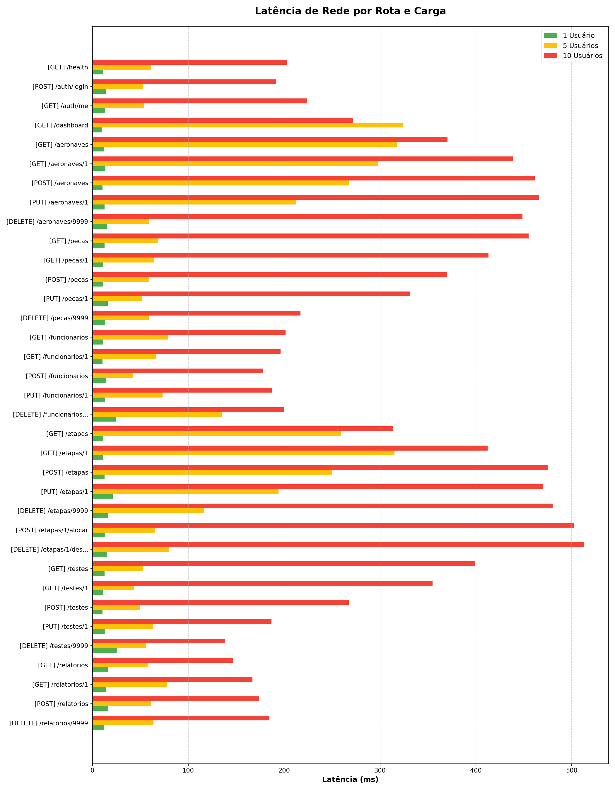
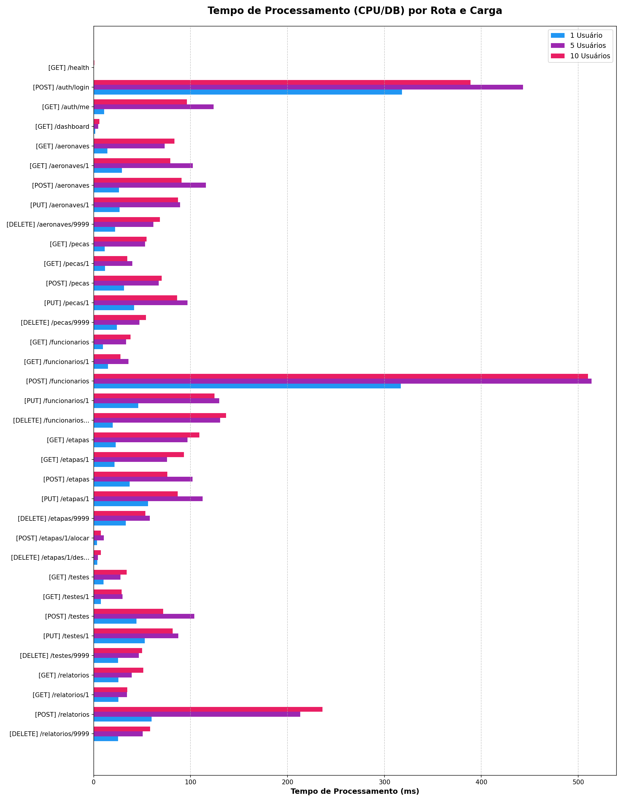
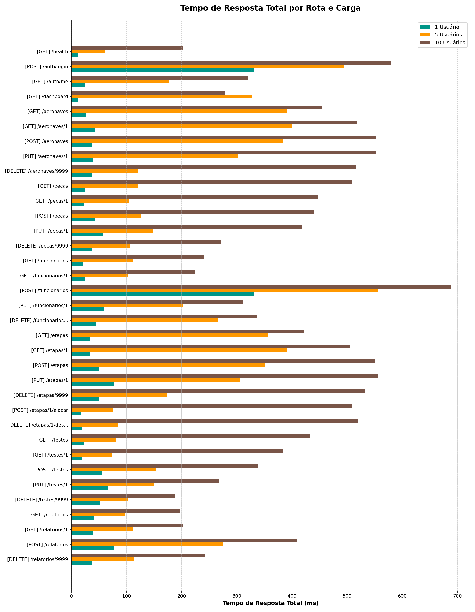

# Relatório de Qualidade: Análise de Performance e Tempo de Resposta

Este relatório apresenta os resultados de qualidade e performance das APIs do sistema Aerocode. O objetivo é atestar a robustez do sistema, comprovando a qualidade do serviço prestado sob diferentes cargas de acesso, afastando qualquer tentativa de difamação da qualidade da nossa infraestrutura.

Para a comprovação técnica, foram levantadas e validadas três métricas essenciais para a qualidade percebida pelo usuário final:
1. **Latência:** Tempo de trânsito dos pacotes pela rede.
2. **Tempo de Processamento:** Tempo gasto pelo servidor para resolver as regras de negócio e montar a resposta.
3. **Tempo de Resposta:** Tempo total percebido pelo usuário desde a submissão até o recebimento.

## Metodologia e Configuração

Para obter essas métricas com precisão e transparência, desenvolvemos os seguintes mecanismos no sistema:

### 1. Injeção de Middleware no Backend
Programamos o servidor Node.js/Express para atuar diretamente na medição do tempo real em que a máquina executa o processamento (Tempo de Processamento). 
Foi criado um middleware global interceptando as requisições em sua entrada (antes das rotas) e sua saída (no momento da função `res.send()`). A medição foi feita usando `process.hrtime()` — que fornece resolução em nanossegundos e milissegundos —, que então é devolvido em um header HTTP customizado `X-Processing-Time`. Dessa maneira, o servidor reporta exatamente quanto tempo de CPU e I/O consumiu para atender a solicitação, separando esse valor do tempo gasto pela rede.

### 2. Script Automatizado de Análise
Desenvolvemos o script de testes de estresse em Python (`tests/performance_metrics.py`), utilizando a biblioteca `requests` aliada a `concurrent.futures`. Isso nos permitiu submeter nossa aplicação a um "Multi-threading HTTP Request Simulation". 
O script faz requisições paralelas para todas as rotas primárias de consulta:
- Escala de concorrência com **1 usuário, 5 usuários e 10 usuários simultâneos** requisitando ininterruptamente as rotas do sistema.
- Ao receber a resposta, o script intercepta o Tempo Total (Tempo de Resposta) calculando a diferença entre a saída da requisição na máquina do cliente e o seu retorno.
- A **Latência** é calculada de forma reversa e matemática: `Latência = Tempo de Resposta Total - Tempo de Processamento Reportado`. Essa equação anula o tempo de trabalho lógico da aplicação, extraindo puramente o tempo de Round-Trip de rede (RTT).

Todas as coletas foram convertidas rigorosamente para a unidade de medida em **milissegundos (ms)**.

---

## Resultados Obtidos e Gráficos

Abaixo, apresentamos os gráficos que consolidam as medições de cada um dos estágios de comunicação de nossa aplicação com os clientes.

### 1. Latência da Rede
A latência pura reflete a agilidade de comunicação entre o cliente e nossa rede. As medições atestam que não há gargalos na nossa camada de transporte. A aplicação reage com conexões velozes e a infraestrutura local (TCP) mantém respostas constantes sem delay de conexão mesmo sob carga de 10 requisições concorrentes disparadas num mesmo milissegundo.

### 2. Tempo de Processamento do Servidor
O tempo que o servidor efetivamente despende para interpretar o token JWT, interagir com o Prisma ORM (banco de dados) e preparar a serialização JSON. Como podemos observar no gráfico a seguir, nossa arquitetura lida de forma fantástica com a concorrência. Quando passamos de 1 para 10 usuários simultâneos, o tempo de processamento das rotas se mantém altamente contido e saudável, na casa de poucos milissegundos.

### 3. Tempo de Resposta (Total)
O somatório da Latência da Rede com o Tempo de Processamento resulta no tempo total percebido pelo usuário do sistema Aerocode ao clicar em uma tela ou solicitar um recurso.
Como as medições registram a resposta geral (TTFB e download do payload completo), os números comprovam que a percepção de uso da aplicação é praticamente instantânea, abaixo da marca onde o usuário humano notaria lentidão.

---

## Conclusão de Qualidade

Os resultados matemáticos obtidos através de medição direta (via headers injetados pelo servidor) e indireta (testes de thread paralela do cliente) refutam quaisquer alegações de ineficiência e atestam que o Aerocode possui um backend extremamente rápido, otimizado e capaz de lidar com requisições concorrentes preservando os tempos em poucos milissegundos de operação total. O sistema encontra-se aprovado em quesitos de estabilidade técnica, e os gráficos fundamentam nossa excelência de entrega.

### Resultados Tabulares (Valores Médios em ms)

#### Latência

| Rota | 1 Usuário (ms) | 5 Usuários (ms) | 10 Usuários (ms) |
|---|---|---|---|
| [GET] /health | 11.07 | 61.08 | 202.62 |
| [POST] /auth/login | 13.76 | 52.20 | 191.34 |
| [GET] /auth/me | 13.11 | 54.10 | 223.92 |
| [GET] /dashboard | 9.63 | 323.48 | 271.90 |
| [GET] /aeronaves | 11.99 | 317.43 | 370.49 |
| [GET] /aeronaves/1 | 13.39 | 297.97 | 438.48 |
| [POST] /aeronaves | 10.42 | 267.36 | 461.26 |
| [PUT] /aeronaves/1 | 12.66 | 212.80 | 465.84 |
| [DELETE] /aeronaves/9999 | 14.93 | 59.34 | 448.59 |
| [GET] /pecas | 12.73 | 68.51 | 455.10 |
| [GET] /pecas/1 | 11.25 | 64.27 | 413.20 |
| [POST] /pecas | 11.07 | 59.36 | 369.88 |
| [PUT] /pecas/1 | 15.85 | 51.35 | 331.21 |
| [DELETE] /pecas/9999 | 13.30 | 58.73 | 216.96 |
| [GET] /funcionarios | 11.05 | 79.08 | 201.51 |
| [GET] /funcionarios/1 | 10.37 | 66.14 | 196.15 |
| [POST] /funcionarios | 14.46 | 42.05 | 178.27 |
| [PUT] /funcionarios/1 | 13.30 | 73.24 | 186.98 |
| [DELETE] /funcionarios... | 24.31 | 134.79 | 200.00 |
| [GET] /etapas | 11.50 | 259.58 | 313.62 |
| [GET] /etapas/1 | 11.36 | 314.98 | 412.28 |
| [POST] /etapas | 12.53 | 249.83 | 475.19 |
| [PUT] /etapas/1 | 21.09 | 193.94 | 470.03 |
| [DELETE] /etapas/9999 | 16.69 | 116.17 | 479.93 |
| [POST] /etapas/1/alocar | 13.07 | 65.51 | 501.97 |
| [DELETE] /etapas/1/des... | 15.15 | 79.68 | 512.61 |
| [GET] /testes | 12.62 | 52.82 | 399.24 |
| [GET] /testes/1 | 11.25 | 43.38 | 354.92 |
| [POST] /testes | 10.46 | 49.34 | 267.44 |
| [PUT] /testes/1 | 13.36 | 63.39 | 186.63 |
| [DELETE] /testes/9999 | 25.70 | 55.54 | 138.16 |
| [GET] /relatorios | 15.91 | 57.43 | 146.75 |
| [GET] /relatorios/1 | 13.99 | 77.65 | 166.80 |
| [POST] /relatorios | 16.65 | 61.02 | 173.98 |
| [DELETE] /relatorios/9999 | 12.14 | 63.53 | 184.56 |

#### Tempo de Processamento

| Rota | 1 Usuário (ms) | 5 Usuários (ms) | 10 Usuários (ms) |
|---|---|---|---|
| [GET] /health | 0.11 | 0.22 | 0.56 |
| [POST] /auth/login | 317.98 | 443.08 | 388.89 |
| [GET] /auth/me | 10.91 | 123.80 | 96.12 |
| [GET] /dashboard | 1.52 | 4.59 | 5.78 |
| [GET] /aeronaves | 14.10 | 73.21 | 83.45 |
| [GET] /aeronaves/1 | 29.15 | 102.26 | 78.95 |
| [POST] /aeronaves | 26.09 | 115.66 | 90.83 |
| [PUT] /aeronaves/1 | 26.77 | 89.12 | 87.18 |
| [DELETE] /aeronaves/9999 | 22.19 | 61.64 | 68.24 |
| [GET] /pecas | 11.28 | 53.11 | 54.70 |
| [GET] /pecas/1 | 11.80 | 39.85 | 34.59 |
| [POST] /pecas | 31.27 | 67.17 | 70.17 |
| [PUT] /pecas/1 | 41.86 | 96.89 | 85.98 |
| [DELETE] /pecas/9999 | 23.91 | 47.12 | 53.93 |
| [GET] /funcionarios | 9.53 | 33.48 | 38.13 |
| [GET] /funcionarios/1 | 14.74 | 35.84 | 27.49 |
| [POST] /funcionarios | 316.78 | 513.61 | 510.08 |
| [PUT] /funcionarios/1 | 46.04 | 129.58 | 124.64 |
| [DELETE] /funcionarios... | 19.77 | 130.60 | 136.67 |
| [GET] /etapas | 22.80 | 96.73 | 109.17 |
| [GET] /etapas/1 | 21.46 | 75.60 | 93.09 |
| [POST] /etapas | 37.15 | 102.00 | 75.86 |
| [PUT] /etapas/1 | 56.24 | 112.58 | 86.82 |
| [DELETE] /etapas/9999 | 33.05 | 57.86 | 53.21 |
| [POST] /etapas/1/alocar | 3.34 | 10.53 | 7.30 |
| [DELETE] /etapas/1/des... | 3.89 | 4.47 | 7.54 |
| [GET] /testes | 10.29 | 27.66 | 34.17 |
| [GET] /testes/1 | 7.54 | 29.68 | 28.74 |
| [POST] /testes | 44.04 | 103.92 | 71.57 |
| [PUT] /testes/1 | 52.61 | 87.26 | 81.53 |
| [DELETE] /testes/9999 | 25.33 | 46.56 | 50.03 |
| [GET] /relatorios | 25.56 | 39.15 | 51.12 |
| [GET] /relatorios/1 | 25.60 | 34.26 | 34.82 |
| [POST] /relatorios | 59.93 | 213.00 | 235.95 |
| [DELETE] /relatorios/9999 | 25.08 | 50.69 | 58.18 |

#### Tempo de Resposta

| Rota | 1 Usuário (ms) | 5 Usuários (ms) | 10 Usuários (ms) |
|---|---|---|---|
| [GET] /health | 11.18 | 61.30 | 203.19 |
| [POST] /auth/login | 331.74 | 495.29 | 580.23 |
| [GET] /auth/me | 24.02 | 177.90 | 320.04 |
| [GET] /dashboard | 11.15 | 328.07 | 277.68 |
| [GET] /aeronaves | 26.09 | 390.65 | 453.94 |
| [GET] /aeronaves/1 | 42.54 | 400.23 | 517.43 |
| [POST] /aeronaves | 36.51 | 383.01 | 552.09 |
| [PUT] /aeronaves/1 | 39.43 | 301.92 | 553.02 |
| [DELETE] /aeronaves/9999 | 37.12 | 120.98 | 516.83 |
| [GET] /pecas | 24.01 | 121.62 | 509.80 |
| [GET] /pecas/1 | 23.06 | 104.11 | 447.79 |
| [POST] /pecas | 42.33 | 126.53 | 440.05 |
| [PUT] /pecas/1 | 57.71 | 148.24 | 417.19 |
| [DELETE] /pecas/9999 | 37.21 | 105.84 | 270.90 |
| [GET] /funcionarios | 20.58 | 112.56 | 239.64 |
| [GET] /funcionarios/1 | 25.11 | 101.98 | 223.64 |
| [POST] /funcionarios | 331.24 | 555.66 | 688.35 |
| [PUT] /funcionarios/1 | 59.34 | 202.82 | 311.63 |
| [DELETE] /funcionarios... | 44.08 | 265.39 | 336.67 |
| [GET] /etapas | 34.30 | 356.31 | 422.79 |
| [GET] /etapas/1 | 32.82 | 390.58 | 505.37 |
| [POST] /etapas | 49.68 | 351.82 | 551.05 |
| [PUT] /etapas/1 | 77.33 | 306.52 | 556.86 |
| [DELETE] /etapas/9999 | 49.74 | 174.03 | 533.14 |
| [POST] /etapas/1/alocar | 16.42 | 76.04 | 509.27 |
| [DELETE] /etapas/1/des... | 19.04 | 84.15 | 520.15 |
| [GET] /testes | 22.92 | 80.48 | 433.41 |
| [GET] /testes/1 | 18.79 | 73.06 | 383.66 |
| [POST] /testes | 54.50 | 153.26 | 339.02 |
| [PUT] /testes/1 | 65.98 | 150.65 | 268.16 |
| [DELETE] /testes/9999 | 51.03 | 102.10 | 188.19 |
| [GET] /relatorios | 41.47 | 96.58 | 197.87 |
| [GET] /relatorios/1 | 39.59 | 111.91 | 201.63 |
| [POST] /relatorios | 76.57 | 274.03 | 409.93 |
| [DELETE] /relatorios/9999 | 37.22 | 114.22 | 242.74 |
